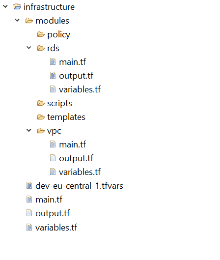

# gcp-terraform

terraform DevOps for GCP

Based mostly on [Hardening your cluster's security](https://cloud.google.com/kubernetes-engine/docs/how-to/hardening-your-cluster) and [GKE's Security overview](https://cloud.google.com/kubernetes-engine/docs/concepts/security-overview).


## Prerequisites

- Install `gcloud`
- Install `kubectl`
- Install `docker`

```
projectName=mygke
randomSuffix=$(shuf -i 100-999 -n 1)
projectId=$projectName-$randomSuffix
region=us-east4
zone=us-east4-a
clusterName=$projectName

## Setup Project

folderId=FIXME
gcloud projects create $projectId \
    --folder $folderId \
    --name $projectName
gcloud config set project $projectId
# Get the billingAccountId from `gcloud beta billing accounts list`
billingAccountId=FIXME
gcloud beta billing projects link $projectId \
    --billing-account $billingAccountId
```

Here are the exhaustive list of the security best practices with your GKE clusters you should look at:
- [X] [Use least privilege Google service accounts](https://cloud.google.com/kubernetes-engine/docs/how-to/hardening-your-cluster#use_least_privilege_sa)
- [ ] [Creating a Private cluster](https://cloud.google.com/kubernetes-engine/docs/how-to/private-clusters)
- [X] [Adding authorized networks for cluster master access](https://cloud.google.com/kubernetes-engine/docs/how-to/authorized-networks)
- [X] [Nodes auto-upgrades](https://cloud.google.com/kubernetes-engine/docs/concepts/node-auto-upgrades)
- [X] [Container-Optimized OS](https://cloud.google.com/container-optimized-os/docs/concepts/features-and-benefits)
- [X] [Using Shielded GKE Nodes](https://cloud.google.com/kubernetes-engine/docs/how-to/shielded-gke-nodes)
- [ ] [RBAC](https://cloud.google.com/kubernetes-engine/docs/how-to/role-based-access-control)
- [X] [Enable network policy](https://cloud.google.com/kubernetes-engine/docs/how-to/network-policy)
- [X] [Enable Workload Identity](https://cloud.google.com/kubernetes-engine/docs/how-to/workload-identity)
- [X] [Enable Binary Authorization](https://cloud.google.com/binary-authorization/docs/overview)
- [X] [Enable Vulnerability scanning on container registry](https://cloud.google.com/container-registry/docs/vulnerability-scanning)
- [ ] [Application-layer Secrets Encryption](https://cloud.google.com/kubernetes-engine/docs/how-to/encrypting-secrets)
- [X] [Using network policy logging with Dataplane V2/eBPF](https://cloud.google.com/kubernetes-engine/docs/how-to/network-policy-logging)
- [X] [(beta) Confidential VMs](https://cloud.google.com/blog/products/identity-security/introducing-google-cloud-confidential-computing-with-confidential-vms)

Here are actions you may want to do once your GKE clusters are deployed to help solidify your security posture:
- [Having a GitOps approach to deploy your app in GKE](https://www.weave.works/blog/what-is-gitops-really) or for example [Anthos Config Management](https://cloud.google.com/anthos/config-management)
- [Observing your GKE clusters with Google Cloud Ops Suite](https://cloud.google.com/stackdriver/docs/solutions/gke/observing)
- [Control plane IP rotation](https://cloud.google.com/kubernetes-engine/docs/how-to/ip-rotation)
- [Credential rotation](https://cloud.google.com/kubernetes-engine/docs/how-to/credential-rotation)
- [Configure Security Context](https://kubernetes.io/docs/tasks/configure-pod-container/security-context/)
- [Harden workload isolation with GKE Sandbox](https://cloud.google.com/kubernetes-engine/docs/how-to/sandbox-pods)
- Cloud Armor (DDOS + WAF) - FIXME

##  Terraform code structure


- _modules :_ This folder should contain terraform code for resource creation . Examples : vpc,rds,subnets etc. Creating modules promotes reusability, hence reducing code duplication. Also each of the sub-folders/resources in modules should contain a structure like : main.tf , variables.tf , output.tf
- _policy :_ This folder should contain policy documents such as IAM role policies as json files .So this folder should act as a collection of policies which would be used by the modules folder. Examples : rds_iam_role_polcy.json , etc.
- _scripts :_ The folder should contain any scripts such as shells scripts or python scripts used for any resource handling or creation . Hence it acts a common place of any kind of script we write for our infra.
- _templates :_ In terraform we can use “.tpl” files for various purpose , in such a case we can keep those files in this folder for clarity.
- _main.tf :_ This file acts the entry point when we call terraform commands like init, validate , plan ,deploy and destroy.
- _output.tf :_ The outputs which need to be written to the state should be present here.
- _variables.tf :_ The variables used should be present in this file.
- _{env}-{region}.tfvars :_ Examples of such files are :
  - For dev and region — eu-central-1 , the expected file name should be : dev-eu-central-1.tfvars .
  - For int and region — eu-central-1 , the expected file name should be : int-eu-central-1.tfvars and so on.
  The files contain initialized values for the variables declared in variables.tf file.

Complementary resources:
- [Infrastructure as a code best practices : Terraform](https://medium.com/@ranjana-jha/infrastructure-as-a-code-best-practices-terraform-d7ae4291d621)
- [The Unofficial Google Kubernetes Engine (GKE) Security Guide](https://gkesecurity.guide/)
- [Best practices for enterprise multi-tenancy with GKE](https://cloud.google.com/kubernetes-engine/docs/best-practices/enterprise-multitenancy)
- [Security blueprint: PCI on GKE](https://cloud.google.com/architecture/blueprints/gke-pci-dss-blueprint)
- [Security in KubeCon Europe 2020](https://blog.aquasec.com/kubecon-2020-europe)